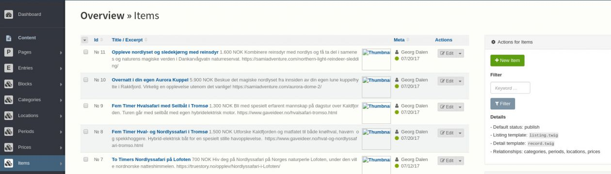
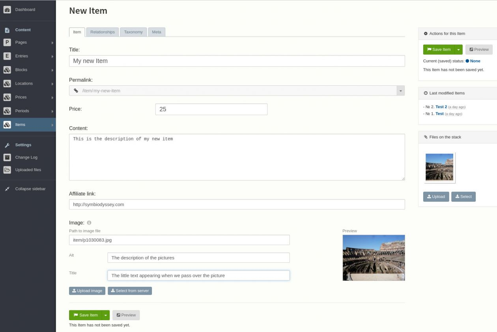

Edit an item
============

From the dashboard, click on Items in the menu on the left.

You should reach the item overview page, similar to this illustration :

Add a new item
##############

Based on the illustration above, click on the "New Item" button on the top right area.

You should then reach the new item page, similar to the following illustration :

As you can see, there are multiple tabs "Item", "Relationships", "Taxonomy" and "Meta". The tabs could vary according to your configuration.

Item
####

Allows you to edit your new item with the following options :

* Title, the title of your product or service
* Permalink, the unique link to this item, based on the title.
* Price, the price of the item. It's a text field you can write whaterever you want (25, 25$, 25€, thenty-five dollars, ...)
* Content, the description of the product. Like on twitter you have 140 characters to describe your item
* Affiliate link, the link to the affiliate page. If a user click on the item tile she will be redirected to this page
* Image, an illustration of your product. The default size is 400x300px. We recommand you to use an image editor to resize the picture if needed.

Relationships
#############

This is where you can set the categories (location, price, period, ...) of an item. You can set zero or more categories even of the same kind. As you type, suggestions will appear.

The item will be listed in every category that you have chosen.

Taxonomy
########

Edit the tags of an item.

Meta
####

Set a few parameters about the item such as :

* The status, if it is published or not
* The publication date, if you want to publish it automatically in the future
* The "depublication" date if you want to remove the item after a while
* The owner of the item

Edit an existing item
#####################

On the item overview page, click on the item to modify in the list. You will rech the edition page where you can edit the data. Please read the "Add a new item" section above to understand the meaning of the diffirent tabs and fields.

Note: when you click on "Save item", if there is no error and the item is already published, the new data will be visible instantly.

Delete an item
##############

On the item overview page, click on the checkbox of every item that you would like to delete, then on the bottom of the page click on the "Delete" button.

Beware : this will delete complitely and instantly, without option to get the data back.