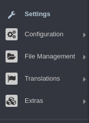
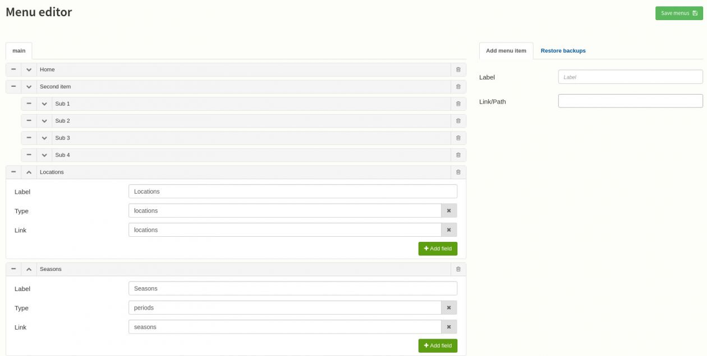
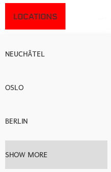

Edit the menu
=============

Log in to the dashboard of your website. In the dashboard, in the menu on the left select "Extras" and then "Menu Editor"

The Menu Editor should look like this :

Add a menu item
###############

In the menu editor, on the top right, you can add a new menu item. Set a label and a path or a link.

A path is a link to a resource in Bolt. For instance prices or locations to link to one of the categories.

A link will be used to point to another website. don't forget to add http:// or https:// for instance : http://example.com

Categories as submenu
#####################

If you want to create as sub menu with your categories, click on the "Add field" button corresponding to your menu. In the popup write "Type" as label and the name of the category in small letter and plural. For instance :

Add field to menu item

Don't forget to save your menu with the button on the top right.